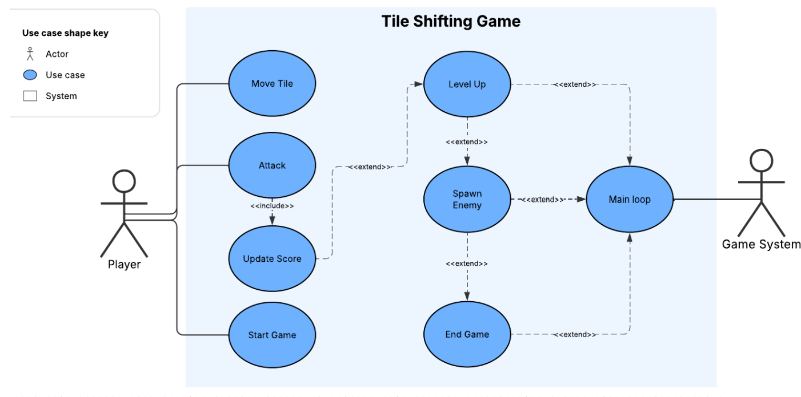
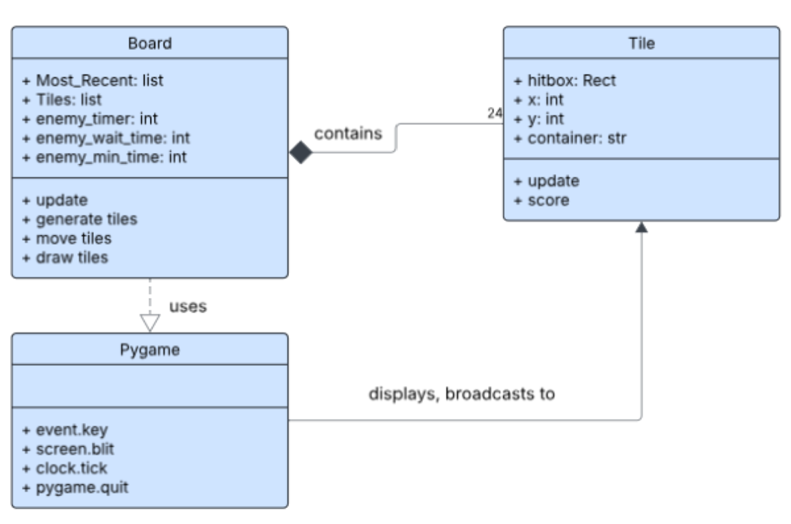
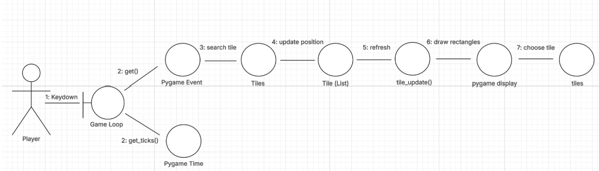

# Tile Shift

A tile-sliding arcade game built with Python and Pygame. Control a blank space on a 5×5 grid to dodge and destroy enemy tiles before they overrun the board.

## Overview

Tile Shift is a 2D arcade game where the player controls a blank tile on a 5×5 grid. Slide the blank space using the arrow keys, then snap to a new position with spacebar to eliminate enemy tiles. Enemies spawn at increasing rates — survive as long as possible and maximize your score.

## Features

* 5×5 sliding tile grid with smooth animation
* Player tile with directional movement (arrow keys)
* Attack mechanic via spacebar (snap to last moved tile)
* Enemy spawning with escalating difficulty
* Live score tracking

## How to Play

| Control      | Action                           |
|-------------|----------------------------------|
| Arrow keys  | Slide the blank space            |
| Spacebar    | Attack — become the last tile moved |

Destroy red enemy tiles to earn points. The blank space fills in behind you as you move.

## Architecture

### Tech Stack

| Layer     | Technology            |
|-----------|----------------------|
| Language  | Python 3.x            |
| Graphics  | Pygame                |
| Platform  | Desktop (cross-platform) |

### System Design

The game is structured around a flat tile list. Each tile is stored as:

  [pygame.Rect, grid_x, grid_y, state]

Where state is one of: `blank`  `player` or `enemy`

Key modules:
* **Tile generation** — builds the 5×5 grid at startup, removes the center tile to create the blank space
* **tile_update()** — renders all tiles each frame based on their current state
* **Input handler** — moves the blank space and resolves player/enemy collisions on spacebar
* **Enemy spawner** — timer-based system that places enemies at random tiles, with spawn rate increasing over time

## Diagrams

### Use Case Diagram



### Class Diagram



### Communication Diagram



## Setup & Installation

Clone the repository
```bash
git clone https://github.com/Z-Bauer/Tiles-Project
cd Tiles-Project
```

Install dependencies
```bash
pip install pygame
```
Run the game
```bash
python Tiles-Test.py
```

## Project Status

Sprint 3 in progress. See our [JIRA board](https://cis-project-350-tiles-table.atlassian.net/jira/software/projects/SCRUM/boards/1/backlog?atlOrigin=eyJpIjoiNzAyODU1NTE3OGRlNGNiYzhlODg4ODA0N2UzZjAwNGEiLCJwIjoiaiJ9) for current tasks and backlog.

## Team

| Name |
|------|
| Zach Bauer |
| Sam Sikorski |
| William Wen |
